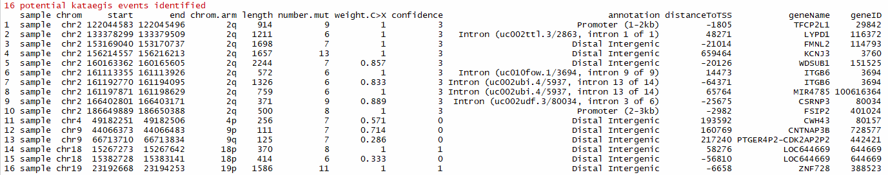

## Support CHM13
 you need to build your own BSgenome and install it
 or you can download it directly and install it locally.
 https://drive.google.com/file/d/1_aezGIwybIFoedRTqEC2aBTVXP5Jyhu-/view?usp=sharing

 then 
```R
library(BSgenome.Hsapiens.CHM13)
mutSNP = mutSNP.input(mut.data = mutData,
			chr = "chr",
			pos = "pos",
			ref = "ref",
			alt = "alt",
			build = "CHM13") 
```
## KataegisPortal 

KataegisPortal is an R package that provides utilities to detect and visualize the Kataegis events from single nucleotide variants (SNVs). 


## Installation
```R
library(devtools)
install_github("MeichunCai/KataegisPortal")
```

## How to use

```R
# Load packages
library(KataegisPortal)
library(BSgenome)
library(BSgenome.Hsapiens.UCSC.hg19)

# Read in snv data
mutData <- system.file("examples", "mutData.txt", package="KataegisPortal")
mutData <- read.table(mutData, header = TRUE,sep = "\t",as.is = TRUE)
head(mutData)

# Covert to KataegisPortal input
mutSNP = mutSNP.input(mut.data = mutData,
			chr = "chr",
			pos = "pos",
			ref = "ref",
			alt = "alt",
			build = "hg19")

# Identify potential kataegis events
katPoint(mutSNP)
```

- weight.C>X: proportion of C>X mutations
- confidence: confidence degree of potential kataegis events (range: 0 to 3, 0 - a hypermutation with weight.C>X < 0.8; 1 - one hypermutation with weight.C>X >= 0.8 in a chromosome; 2 - two hypermutations with weight.C>X >= 0.8 in a chromosome; 3 - high confidence with three or more hypermutations with weight.C>X >= 0.8 in a chromosome)
```R
# Identify potential kataegis events with annonation
library(ChIPseeker)
library(TxDb.Hsapiens.UCSC.hg19.knownGene)
katPoint(mutSNP,txdb = TxDb.Hsapiens.UCSC.hg19.knownGene)
```

```R
# Plot intermutation distance to display kataegis or hyper mutated genomic regions
mutDis.plot(plot.data = mutSNP, sample="Test")
```

```R
mutDis.plot(plot.data = mutSNP, sample="Test", chr = "chr2")
```

```R
# Plot of flanking sequence of all C>X mutations or C>X mutations within a chromosome/chromosome arm
baseSpe.plot(plot.data = mutSNP, sample="Test")
```

```R
baseSpe.plot(plot.data = mutSNP, sample="Test", chr = "chr2",arm="q")
```


## Citation
- Xia Yin, Rui Bi, Pengfei Ma, Shengzhe Zhang, Yang Zhang, Yunheng Sun, Yi Zhang, Ying Jing, Minhua Yu, Wenjing Wang, Li Tan, Wen Di #, Guanglei Zhuang #, Mei-Chun Cai #. Multiregion whole-genome sequencing depicts intratumor heterogeneity and punctuated evolution in ovarian clear cell carcinoma. Journal of Medical Genetics. 2019 Dec 20;jmedgenet-2019-106418. doi: 10.1136/jmedgenet-2019-106418.

